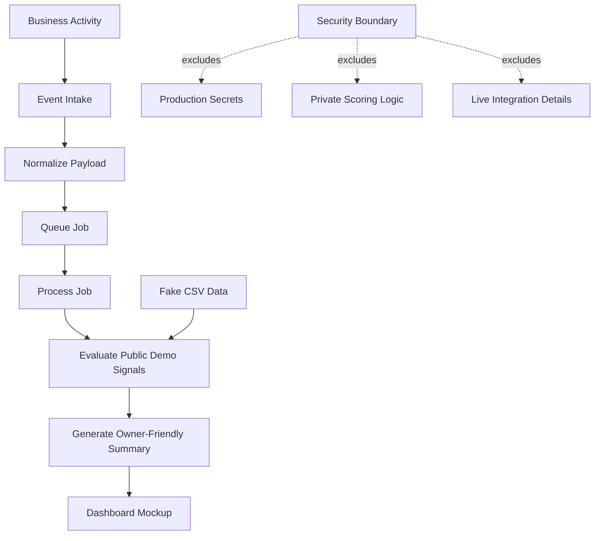

# Architecture Flow Diagram

```mermaid
flowchart TD
    A[Business Activity] --> B[Event Intake]
    B --> C[Normalize Payload]
    C --> D[Queue Job]
    D --> E[Process Job]
    E --> F[Evaluate Public Demo Signals]
    F --> G[Generate Owner-Friendly Summary]
    G --> H[Dashboard Mockup]

    I[Fake CSV Data] --> F
    J[Security Boundary] -. excludes .-> K[Production Secrets]
    J -. excludes .-> L[Private Scoring Logic]
    J -. excludes .-> M[Live Integration Details]
```
