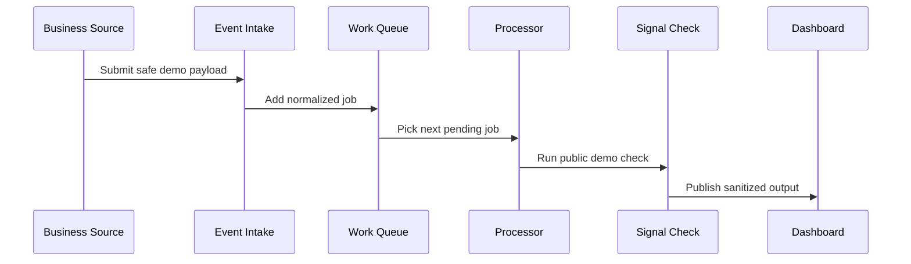

# Event-Driven Workflow

This document explains the public, sanitized version of the Simpl Ops workflow pattern.

## Concept

Instead of treating a dashboard as a static report, Simpl Ops treats business activity as events that can trigger evaluation, summarization, and follow-up.

## Generic Event Lifecycle

## Example Public Event Types

The public demo uses generic event names:

- `activity_snapshot_received`
- `booking_snapshot_received`
- `capacity_snapshot_received`
- `weekly_owner_update_received`

These names are intentionally generic. They do not represent the full private production workflow.

## Queue States

The demo queue processor uses common states:

- `pending`
- `processing`
- `completed`
- `failed`

## Design Benefits

- Intake can be separated from processing.
- Failed jobs can be inspected.
- New public demo checks can be added without changing the intake layer.
- The dashboard can display processed outputs instead of raw event noise.

## What Is Not Shown

The public workflow does not include production routing rules, Make.com scenarios, webhook details, private retry logic, advisory logic, client-specific workflows, or exact automation design.
